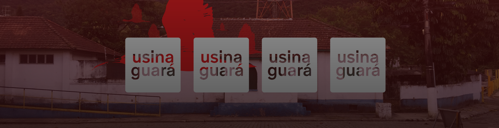

# 🏭 Usina Guará — Plataforma Digital

<div align="center">
  

  <br/>

  [](https://nodejs.org/)
  [](https://reactjs.org/)
  [](https://tailwindcss.com/)
  [](https://www.typescriptlang.org/)
  [](https://www.mongodb.com/)

  <p align="center">
    <b>Plataforma digital completa para gestão de conteúdo, identidade e presença online do coletivo Usina Guará.</b>
  </p>

  <p align="center">
    <a href="https://usinaguara.com/">🌐 Site Oficial</a> • 
    <a href="https://site-v5hr.onrender.com/api-docs/">📄 Documentação da API</a>
  </p>
</div>

---

## 📌 Visão Geral

Este repositório concentra toda a **infraestrutura digital da Usina Guará**, integrando frontend e backend de forma desacoplada, escalável e segura.

A plataforma foi desenvolvida para oferecer **autonomia total** ao coletivo na gestão de:

- Conteúdos editoriais e institucionais
- Projetos culturais
- Membros e colaboradores
- Identidade visual e presença digital

Tudo isso através de um **CMS personalizado**, adaptado às necessidades reais da organização.

> [!IMPORTANT]
> O projeto segue a arquitetura de **monorepo**, onde **frontend e backend são aplicações independentes**.  
> Cada módulo possui seu próprio fluxo de desenvolvimento, build e deploy.


---

## 🧱 Arquitetura do Projeto

O sistema é dividido em dois módulos principais, cada um com responsabilidades bem definidas:

| Módulo | Stack | Responsabilidade |
|------|------|------------------|
| **[Backend](./backend)** | Node.js · TypeScript · TSOA | API REST, regras de negócio, autenticação e persistência de dados |
| **[Frontend](./frontend)** | React · TypeScript · Tailwind | Interface pública, painel administrativo e experiência do usuário |

> 🔎 Cada módulo possui seu próprio README com instruções detalhadas de setup, padrões e deploy.

> [!NOTE]
> Apesar de compartilharem o mesmo repositório, os módulos **não dependem diretamente entre si** em tempo de execução.
> A comunicação ocorre exclusivamente via API REST.


---

## 🚀 Executando o Projeto Localmente

Para rodar o ambiente completo em desenvolvimento, é necessário configurar **backend e frontend separadamente**.

### 🔧 Pré-requisitos

- **Node.js** (v18 ou superior)
- **Git**
- **MongoDB** (local ou MongoDB Atlas)

> [!WARNING]
> As variáveis de ambiente do backend são obrigatórias para o funcionamento da aplicação.
> Certifique-se de configurar corretamente o `.env` antes de iniciar o servidor.


---

### ▶️ Passo a Passo

#### 1️⃣ Clone o repositório
```bash
git clone https://github.com/UsinaGuara/site.git
cd site
```
#### 2️⃣ Backend
Em um terminal, acesse a pasta e inicie o servidor (veja detalhes no [README do BackEnd](./backend/README.md).
```bash
cd backend
npm install
npm run dev
```
A API estará disponível em:

- **API:** http://localhost:3000  
- **Swagger:** http://localhost:3000/api-docs

---

### 3️⃣ Frontend

Em um novo terminal, siga as instruções no  
[README do Frontend](./frontend/README.md).

```bash
cd frontend
npm install
npm run dev

```

A interface será iniciada em:

- **Frontend:** http://localhost:5173  
  *(ou outra porta definida pelo Vite)*

---

## ☁️ Infraestrutura & Deploy

A plataforma adota uma arquitetura moderna, desacoplada e orientada a serviços:

- **Backend:**  
  Hospedado no **Render**, com deploy automático via branch `main`.

- **Frontend:**  
  Publicado no **GitHub Pages**, utilizando **GitHub Actions** para CI/CD.

- **Banco de Dados:**  
  Cluster gerenciado no **MongoDB Atlas**, garantindo escalabilidade, segurança e alta disponibilidade.

> [!TIP]
> A separação entre frontend e backend garante **escalabilidade independente**,  
> melhor controle de custos e maior segurança operacional.

---

## 👥 Time de Desenvolvimento

<table align="center">
  <tr>
    <td align="center">
      <a href="https://github.com/Laysabernardes">
        <br />
        <sub><b>Laysa Bernardes</b></sub>
      </a><br />
      🚀 Backend & Data Architect
    </td>
    <td align="center">
      <a href="https://github.com/LucasLoopsT">
        <br />
        <sub><b>Lucas Lopes</b></sub>
      </a><br />
      🎨 Frontend & Fullstack
    </td>
  </tr>
</table>


